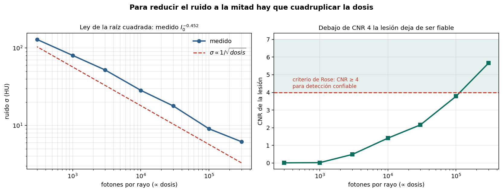
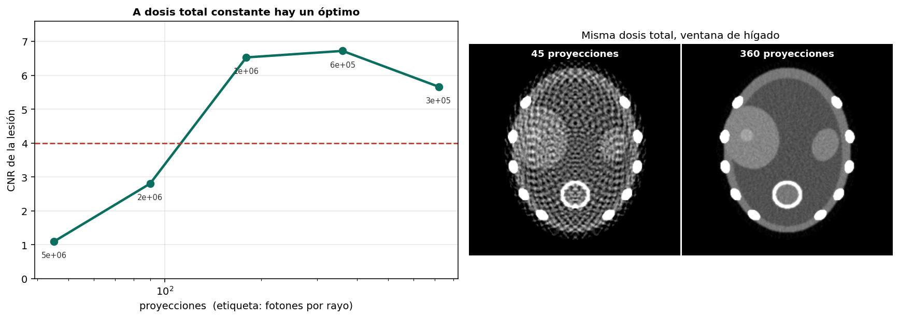
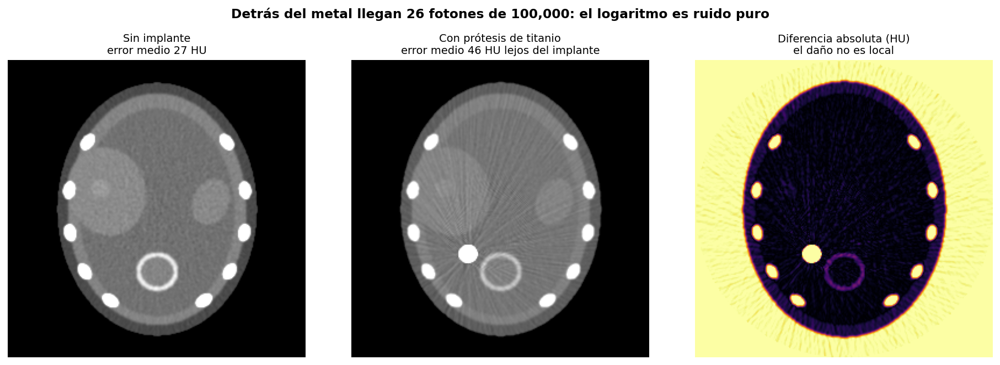

# Dosis contra calidad en tomografía

Medición del compromiso entre dosis de radiación y calidad diagnóstica: la ley de la raíz
cuadrada, el punto donde una lesión deja de ser detectable, el reparto óptimo de dosis, y
el artefacto metálico.



## Resultado principal

**Para reducir el ruido a la mitad hay que cuadruplicar la dosis.**

```
Ajuste: σ ∝ I₀^(-0.452)   |   teoría: I₀^(-0.5)   |   error 0.048
```

| Fotones/rayo | Dosis rel. | σ (HU) | CNR |
|---|---|---|---|
| 3×10⁵ | 1.000 | 6.2 | **5.66** |
| 1×10⁵ | 0.333 | 9.1 | 3.78 |
| 3×10⁴ | 0.100 | 17.9 | 2.16 |
| 3×10³ | 0.010 | 52.1 | 0.48 |

Por el criterio de Rose (CNR ≥ 4 para detección fiable), la lesión de 35 HU de contraste
solo es detectable a dosis completa. ALARA cuantificado: un estudio con dosis insuficiente
hay que repetirlo, y la dosis total acaba siendo mayor.

## El reparto importa más que el total

A dosis total constante (fotones × proyecciones = 2.16×10⁸):

| Proyecciones | Fotones/rayo | CNR |
|---|---|---|
| 45 | 4.8×10⁶ | **1.09** |
| 180 | 1.2×10⁶ | 6.53 |
| 360 | 6.0×10⁵ | **6.72** |
| 720 | 3.0×10⁵ | 5.66 |



Con 45 proyecciones el CNR se derrumba **aunque cada rayo reciba 16× más fotones**. Pocos
fotones producen ruido (aleatorio, promediable); pocas proyecciones producen artefacto de
submuestreo (estructura coherente, que ningún fotón extra elimina).

El criterio clásico —(π/2) × número de detectores ≈ 400 vistas para 256 detectores—
coincide con el óptimo medido.

## Artefacto metálico

```
atenuación máxima sin metal : 4.5
atenuación máxima con metal : 8.3
  → de 100,000 fotones incidentes llegan 26
```



| Región | Error medio (HU) |
|---|---|
| Todo el cuerpo, sin implante | 27.4 |
| **Lejos del implante, con metal** | **46.0** |

El logaritmo de 26 fotones está dominado por ruido de Poisson. Y como cada rayo contribuye
a toda una línea de la imagen, un rayo corrupto contamina su trayectoria completa: de ahí
las rayas que cruzan la imagen entera.

Las técnicas MAR tratan esas lecturas como **datos faltantes** (identificar en el sinograma,
descartar, interpolar) en vez de como datos malos.

## Contenido

```
notebooks/ct_dosis_artefactos.ipynb   Notebook completo, ejecutable sin datos externos
src/fantoma.py                        Corte abdominal en HU, con opción de implante
src/dosis.py                          Barrido de dosis y ley de la raíz cuadrada
src/proyecciones.py                   Reparto de dosis entre fotones y vistas
src/metal.py                          Simulación del artefacto metálico
figuras/                              Figuras generadas
```

## Reproducir

```bash
git clone https://github.com/USUARIO/ct-dosis-artefactos.git
cd ct-dosis-artefactos
pip install -r requirements.txt
jupyter lab notebooks/ct_dosis_artefactos.ipynb
```

## Limitaciones

No se modela el endurecimiento del haz, que con metal es tan importante como el hambre de
fotones. Requiere simular el espectro del tubo.

La dosis se representa solo como fotones por rayo. La dosis real depende también del kVp,
pitch, longitud explorada y modulación automática de corriente; aquí es una proporción, no
milisievert.

El criterio de Rose es una aproximación; los estudios serios usan observadores humanos o
modelos de observador ideal.

Los equipos modernos usan reconstrucción iterativa, no FBP, para dosis baja. Las
conclusiones cualitativas se mantienen; los umbrales exactos, no.

## Referencias

- Rose A. *Vision: Human and Electronic.* Plenum Press, 1973.
- Brenner D.J., Hall E.J. *Computed Tomography — An Increasing Source of Radiation Exposure.* New England Journal of Medicine, 2007.
- Gjesteby L. et al. *Metal Artifact Reduction in CT: Where Are We After Four Decades?* IEEE Access, 2016.
- Kak A.C., Slaney M. *Principles of Computerized Tomographic Imaging.* IEEE Press, 1988.

## Licencia

MIT — ver [LICENSE](LICENSE).
